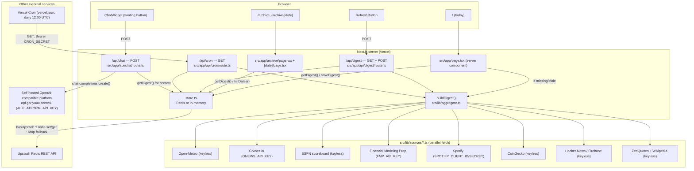

# ARCHITECTURE.md

## Template lineage

`daily-brief` is the **template original** for a family of sibling "briefing" apps —
`anibrief`, `market-brief`, and `dramabrief` (all under `~/Projects/`) reuse this
repo's structural pattern (Next.js App Router, `Section<T>` graceful-degradation
sources, one file per external data source under `lib/sources/`, Redis-or-in-memory
store, floating chat widget over a digest summary). If working on any sibling app,
this file (and FILE_MAP.md/DECISIONS.md) is useful background for the shared pattern —
but each sibling has its own domain, its own external APIs, and may have since diverged
in its own stack choices (e.g. auth, DB provider); do not assume this repo's exact
tech choices apply there without checking that repo's own docs first.

## System overview

Daily Brief is a Next.js 16 App Router application with no traditional backend service —
"backend" logic lives entirely in Next.js route handlers and server components running
on Vercel's serverless/edge runtime. There is no SQL database; persistence is a Redis
key-value store (Upstash) accessed through a thin wrapper with an in-memory fallback.
All "real" data is fetched live from 8 external third-party APIs on demand, aggregated
into one `Digest` JSON object per calendar day, and cached in Redis by date.



## Frontend / backend structure

There is no separate frontend/backend deployment — everything is one Next.js app.
The split that matters is **server vs. client components**:

- **Server components** (default, no `"use client"`): `src/app/page.tsx`,
  `src/app/archive/page.tsx`, `src/app/archive/[date]/page.tsx`, `src/app/layout.tsx`,
  and every one of the 8 digest-section presentational components
  (`src/components/WeatherCard.tsx`, `src/components/NewsList.tsx`, `src/components/SportsScores.tsx`, `src/components/StockMovers.tsx`,
  `src/components/MusicReleases.tsx`, `src/components/CryptoTicker.tsx`, `src/components/TechNews.tsx`, `src/components/ExtraCard.tsx`,
  `src/components/SectionCard.tsx`, `src/components/DigestView.tsx`). These run only on the server, read env vars
  directly, and can call `src/lib/*` freely.
- **Client components** (`"use client"`): `src/components/ChatWidget.tsx` and `src/components/RefreshButton.tsx` —
  both are interactive (state, event handlers) and talk to the server exclusively
  through `fetch()` calls to `/api/chat` and `/api/digest`.

## Server/client boundaries

- `src/lib/sources/*.ts`, `src/lib/store.ts`, and all three `src/app/api/*/route.ts`
  files run **server-only** — they read secret env vars (`GNEWS_API_KEY`, `FMP_API_KEY`,
  `AI_PLATFORM_API_KEY`, `UPSTASH_REDIS_REST_TOKEN`, etc.) that must never reach the
  client bundle. None of these are imported from any `"use client"` file. **Correction
  (2026-08-17):** one `NEXT_PUBLIC_*` variable now exists — `NEXT_PUBLIC_SITE_URL`
  (added commit `7240b1c`, read in `src/app/layout.tsx`, `src/app/robots.ts`, `src/app/sitemap.ts`) — but
  it's a public URL, not a secret, so this doesn't reopen the "no secret leak path"
  conclusion below.
- The client only ever sees the already-aggregated `Digest` JSON (rendered server-side
  into the page, or returned from `/api/digest`/`/api/chat` as JSON) — never the raw
  upstream API responses or any key.

## Request lifecycle

**Visiting `/` (today's brief):**
1. `src/app/page.tsx` (server component, `export const dynamic = "force-dynamic"`) runs
   on every request.
2. Calls `getDigest(todayISO())` (`src/lib/store.ts`).
3. If no digest exists for today, or the stored one is older than 15 minutes
   (`isStale()`, `src/lib/aggregate.ts`), calls `buildDigest()` — which fans out to all 8
   sources in parallel via `Promise.all` — then `saveDigest()`s the result.
4. Renders `<DigestView digest={digest}>`, which renders all 8 section components plus
   a "generated at" timestamp (home-timezone-formatted, `formatLocalTime()`).
5. `<ChatWidget>` (mounted in the root layout, not the page) is present on every page but
   starts collapsed.

**Clicking "🔄 Refresh Now":**
1. `src/components/RefreshButton.tsx` (client) `POST`s to `/api/digest`.
2. `src/app/api/digest/route.ts`'s `POST` handler always rebuilds today's digest from
   live sources (no staleness check) and overwrites the stored snapshot.
3. Client calls `router.refresh()` to re-render the server component with fresh data.

**Scheduled cron run:**
1. Vercel Cron (`vercel.json`, `0 12 * * *` UTC) sends `GET /api/cron` with header
   `Authorization: Bearer $CRON_SECRET` (Vercel does this automatically once
   `CRON_SECRET` is set as a project env var).
2. `src/app/api/cron/route.ts` checks the header against `process.env.CRON_SECRET` — but
   **only if `CRON_SECRET` is set**; if unset, the check is skipped entirely and the
   route is unauthenticated.
3. On success, calls `buildDigest()` + `saveDigest()`, same as the refresh button, but
   always for `todayISO()`.

**Visiting `/archive` or `/archive/[date]`:**
1. `/archive` calls `listDates()` (all archived dates, newest first) and
   `archiveIsPersistent` (whether Upstash is configured) to optionally show a warning.
2. `/archive/[date]` calls `getDigest(date)` directly — no rebuild-if-stale logic (past
   days are immutable once archived); `notFound()` (Next.js 404) if nothing was ever
   saved for that date.

**Chat:**
1. `src/components/ChatWidget.tsx` derives the "context date" from the URL (`/archive/YYYY-MM-DD`
   matches that date; anywhere else, including `/`, means "today", left `undefined` and
   defaulted server-side).
2. `POST /api/chat` with `{ messages, date }`. The route loads that date's stored digest
   (`getDigest`), compresses it into a short plain-text summary
   (`summarizeDigest()` — top ~12 headlines, top 10 games, indices + top 5 gainers/losers,
   etc., not the full JSON), and sends it as the `system`-role message (first entry in
   the `messages` array) to the self-hosted OpenAI-compatible platform, alongside the
   conversation's `messages`.
3. Returns `{ reply: response.choices[0].message.content }`. No streaming.

## Data flow

`External APIs → src/lib/sources/*.ts (Section<T> shape) → buildDigest() (src/lib/aggregate.ts)
→ Digest object → store.ts (Redis or in-memory) → server components → HTML sent to client`.
Nothing is ever cached at the Next.js `fetch()` layer (`revalidate: 0` everywhere) — the
only cache boundary is the 15-minute `isStale()` window plus whatever is already sitting
in Redis/memory from a previous build.

## Auth/authz flow

None. Every route and page is publicly accessible to anyone with the URL. The only
gate anywhere is the optional `CRON_SECRET` bearer check on `GET /api/cron` described
above.

## DB access flow

"DB" here means Upstash Redis, accessed exclusively through `src/lib/store.ts`'s three
functions: `saveDigest(digest)`, `getDigest(date)`, `listDates()`. No other file talks to
Redis directly. If `UPSTASH_REDIS_REST_URL`/`UPSTASH_REDIS_REST_TOKEN` are both set,
`Redis.fromEnv()` (from `@upstash/redis`) is used; otherwise a module-level
`Map<string, Digest>` + `Set<string>` in-memory fallback is used, which does not survive
process restarts or span serverless invocations.

## Storage / external-API flow

No file/blob storage of any kind (no S3, no Vercel Blob, no uploads anywhere in the
app). All "storage" is the Redis digest cache described above. External API flow is
fully described in FEATURES.md and API_REFERENCE.md; architecturally, the key point is
that every one of the 8 `src/lib/sources/*.ts` fetchers is independently
try/catch-wrapped and returns a `Section<T>` — a fetch failure or missing key in one
source can never take down `buildDigest()` or the page render.

## Scheduled / background jobs

**One job**: Vercel Cron, defined entirely in `vercel.json`:
```json
{ "crons": [{ "path": "/api/cron", "schedule": "0 12 * * *" }] }
```
This is the **only** scheduling mechanism in the repo — no GitHub Actions schedule, no
`node-cron`, no queue/worker infrastructure. `0 12 * * *` is a standard 5-field cron
expression meaning "12:00 UTC every day." The route it hits
(`src/app/api/cron/route.ts`) does exactly one thing: `buildDigest()` then
`saveDigest()`. There is no retry logic, no dead-letter handling, and no logging beyond
whatever Vercel's function logs capture by default (no explicit `console.log`/error
tracking added in the route). Because the home page (`src/app/page.tsx`) also
self-heals via `isStale()`, the cron job is a convenience (ensures a digest exists even
if nobody visits before noon) rather than a hard dependency for correctness.

## Caching

- Next.js `fetch()` data cache is explicitly disabled on every external call
  (`{ next: { revalidate: 0 } }`) — always live fetch.
- `src/app/page.tsx`, `src/app/archive/page.tsx`, and `src/app/archive/[date]/page.tsx` all set
  `export const dynamic = "force-dynamic"` — no static generation/ISR for any of them
  (confirmed by `npm run build`'s route table: all marked `ƒ` dynamic except
  `/_not-found` and `/icon.svg`).
- The only "cache" in the traditional sense is the Redis-backed `Digest` snapshot plus
  the 15-minute `isStale()` staleness window on the home page's read path.

## Error handling

Two layers:
1. **Source-level** (`src/lib/sources/*.ts`): every fetcher wraps its logic in
   try/catch and returns `fetchFailed(message)` or `missingKey(envVar, hint)` on
   failure — never throws.
2. **Route-level**: `/api/chat` explicitly checks for a missing `AI_PLATFORM_API_KEY`
   and missing `messages` and returns typed JSON errors (500/400). `/api/digest` and
   `/api/cron` have no explicit try/catch around `buildDigest()`/`saveDigest()` — an
   unexpected throw there (e.g., Redis being unreachable) would surface as an
   unhandled 500 from Next.js's default error handling, not a friendly JSON error.
   This is a real gap — see SECURITY.md / Known issues.

## Logging

No structured logging, no error-tracking SDK (no Sentry/LogRocket/etc.), no
`console.log` calls found anywhere in `src/` at time of audit. Whatever Vercel captures
by default for serverless function invocations is the only observability available.

## Deployment architecture

Single Vercel project (`daily-brief`, per `.vercel/project.json`), Next.js's default
serverless function deployment for each route, plus the Vercel Cron integration
described above. No separate services, no Docker, no infra-as-code files found. See
DEPLOYMENT.md. **Confirmed live** (2026-08-17, read-only fetch) at
`https://daily-brief-lovat.vercel.app`.

## SEO surface (added commit `7240b1c`, 2026-08-13)

Four new App Router special files, all statically generated (confirmed via
`npm run build`'s route table — all marked `○` static): `src/app/opengraph-image.tsx`
(home page OG image, generated via `next/og`'s `ImageResponse`),
`src/app/archive/[date]/opengraph-image.tsx` (per-date OG image, same technique),
`src/app/robots.ts` (`/robots.txt`, disallows `/api/`), `src/app/sitemap.ts`
(`/sitemap.xml`, lists `/` and `/archive`). All four read `NEXT_PUBLIC_SITE_URL` with
the same hardcoded fallback (`https://daily-brief-lovat.vercel.app`). `src/app/layout.tsx`
also gained a full `metadata` object (title template, description, Open Graph, Twitter
card) in the same commit. This is documentation-only scope for this pass — the feature
was already built and working; see FEATURES.md for its status entry.

## Security boundaries

- Secrets (`GNEWS_API_KEY`, `FMP_API_KEY`, `SPOTIFY_CLIENT_ID/SECRET`,
  `AI_PLATFORM_API_KEY`, `UPSTASH_REDIS_REST_TOKEN`, `CRON_SECRET`) are read only in
  server-only files and never referenced from any `"use client"` component — verified
  by grepping for their usage; none appear inside a `"use client"` file.
- `.env.example`/`.env.local` are `.gitignore`d (`.env*`) and confirmed never committed.
- The only network-facing auth boundary is `CRON_SECRET` on `/api/cron`, and it is
  optional/skippable — see "Major architectural risks" below and SECURITY.md.

## Major architectural risks

1. **`/api/cron` is unauthenticated if `CRON_SECRET` is unset** — allows anyone to
   trigger paid/rate-limited API calls (FMP, GNews, Spotify) on demand.
2. **No rate limiting anywhere** — `/api/digest` (POST) and `/api/chat` (which costs
   real usage against the self-hosted platform) can be hit as fast as a client wants.
3. **In-memory store fallback is silently lossy** — if Upstash env vars are ever
   accidentally unset in production, the archive silently stops persisting (a UI banner
   warns on `/archive`, but nothing alerts elsewhere, e.g. the home page).
4. **No error boundary/try-catch around `/api/digest` and `/api/cron`'s top-level
   `buildDigest()`/`saveDigest()` calls** — an unexpected Redis outage or a bug in a
   single source's error handling could surface as a raw 500 instead of a controlled
   response.
5. **Single point of external dependency for the archive feature**: if Upstash's free
   tier is ever exceeded or the account lapses, `hasUpstash` still evaluates true (env
   vars present) but calls could start failing — `src/lib/store.ts` doesn't catch/fallback in
   that case, it would throw up to the caller.
