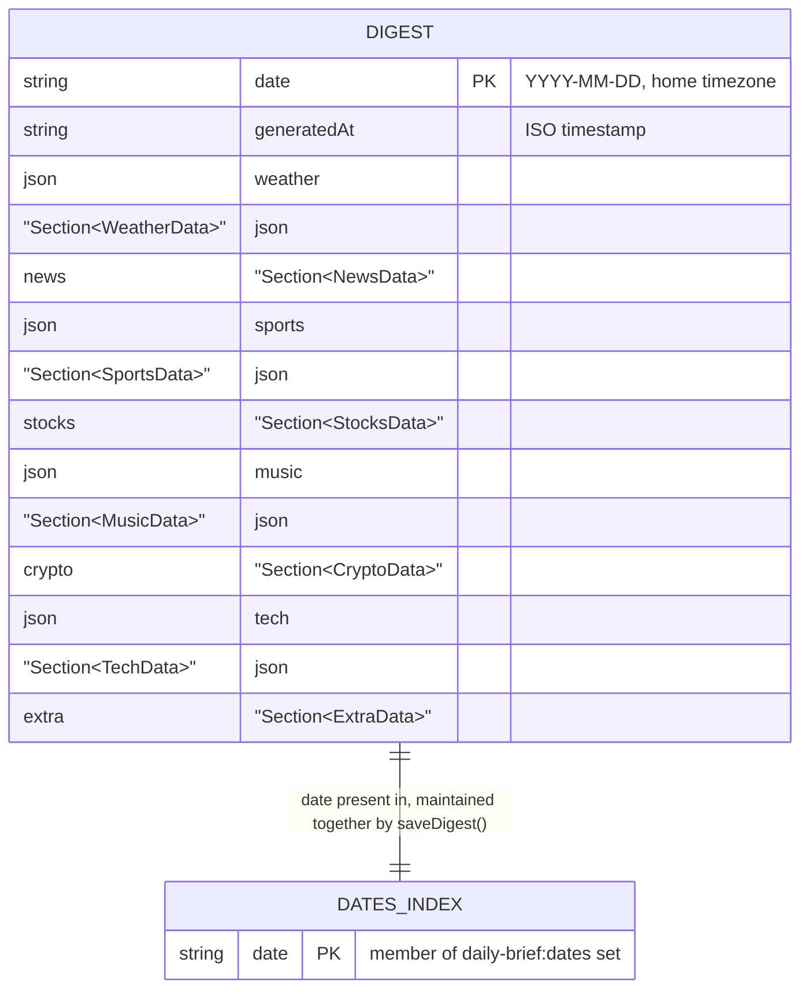

# DATABASE.md

## Provider

No relational/SQL database. Persistence is **Upstash Redis** (REST API,
`@upstash/redis` `^1.38.0`), accessed exclusively through `src/lib/store.ts`. When the
required env vars are absent, the app transparently falls back to an in-memory
`Map`/`Set` (non-persistent, process-local) so local development works with zero setup.

## Schema location

Not schema-enforced by any migration tool (no Prisma/Drizzle/etc.) — Redis is a plain
key-value store here, and the "schema" is simply: what shape of JSON gets `JSON`-
serialized into each key, defined implicitly by the `Digest` TypeScript interface in
`src/lib/types.ts`. There is no separate schema file.

## Keys used ("tables")

| Redis key | Type | Value shape | Written by | Read by |
|---|---|---|---|---|
| `daily-brief:digest:{date}` | String (Upstash auto-serializes/deserializes JSON) | Full `Digest` object (see `src/lib/types.ts`) — `date`, `generatedAt`, and one `Section<T>` per section (`weather`, `news`, `sports`, `stocks`, `music`, `crypto`, `tech`, `extra`) | `saveDigest()` in `src/lib/store.ts` | `getDigest()` in `src/lib/store.ts` |
| `daily-brief:dates` | Set | Set of `YYYY-MM-DD` date strings, one per day a digest was ever saved | `saveDigest()` (`redis.sadd`) | `listDates()` (`redis.smembers`, then sorted descending in application code) |

`{date}` is always a `YYYY-MM-DD` string produced by `todayISO()`
(`src/lib/utils/dates.ts`), computed against the home timezone (`BRIEF_TIMEZONE`, default
`America/New_York`), not the server's UTC clock.

## Relationships

None — this is a flat key-value store, not a relational schema. The only "relationship"
is implicit: `daily-brief:dates` is a set of all keys that exist as
`daily-brief:digest:{date}`, maintained manually in application code (both writes
happen together in `saveDigest()`; there is no foreign-key-style enforcement, so it is
possible in principle for the two to drift if `saveDigest()` is ever changed to write
only one of them).

## Indexes / constraints / enums

None applicable — Redis here provides no schema enforcement, uniqueness constraints, or
secondary indexes beyond the one `daily-brief:dates` set acting as a manually-maintained
index of available digest dates. The `Section<T>`/`Unavailable`/`Ok<T>` union in
`src/lib/types.ts` is the closest thing to an "enum"/constraint, but it is enforced only
at the TypeScript compile-time layer, not at the storage layer — a malformed object
written directly to Redis (outside this codebase) would not be rejected.

## Migrations

None exist and none are needed for a schema-less KV store. **Caution**: if the `Digest`
shape in `src/lib/types.ts` changes in a backward-incompatible way (e.g. renaming a
field), any already-archived digests in production Redis will still have the *old*
shape when read back — there is no versioning or migration logic in `getDigest()` to
handle this. A shape change would need either a manual data migration script or
defensive reading code, neither of which currently exists.

## Seeds

None — no seed script, no fixture data committed to the repo.

## RLS policies

Not applicable — Upstash Redis's REST API has no row-level security concept; access
control is entirely at the "who has `UPSTASH_REDIS_REST_TOKEN`" level (i.e., only this
app's server-side code, via the env var). There is no per-record ownership model
because there is no concept of multiple users in this app (see CLAUDE.md's
"Authentication and authorization").

## Ownership / deletion rules

No deletion logic exists anywhere in the codebase — digests are written and read, never
deleted or updated in place (a re-run of `buildDigest()`/`saveDigest()` for the same
date simply overwrites that date's key). There is no admin UI, script, or API route for
pruning old digests; the archive grows unbounded over time unless manually cleared
directly in the Upstash console (outside this codebase).

## Storage buckets

None — no file/blob storage (no S3, Vercel Blob, Supabase Storage, etc.) anywhere in
the app. All "storage" is the two Redis keys described above.

## Sensitive data

The `Digest` objects stored in Redis contain only already-public information (news
headlines, weather, sports scores, stock prices, etc. — all sourced from public APIs)
— nothing user-supplied, no PII, no credentials. The Redis **credentials themselves**
(`UPSTASH_REDIS_REST_URL`, `UPSTASH_REDIS_REST_TOKEN`) are the sensitive material here,
and they live in env vars, not in the stored data — see SECURITY.md for the finding
that these currently appear to be live values sitting in `.env.example`/`.env.local` on
disk (not committed to git).

## Migration risks

- Changing the `Digest` interface's shape without a backward-compatible reader risks
  breaking rendering of already-archived (old-shape) digests — `/archive/[date]` would
  receive a `Digest` object missing/mismatched fields for any date archived before the
  change.
- Changing the `daily-brief:digest:` or `daily-brief:dates` key prefixes orphans all
  previously-archived data (old keys become unreachable via `listDates()`/`getDigest()`).
- Switching away from Upstash to a different KV/DB provider would require rewriting
  `src/lib/store.ts`'s three exported functions but nothing else, since every caller
  only ever imports `saveDigest`/`getDigest`/`listDates`/`archiveIsPersistent` — the
  storage implementation is well-isolated.

## Entity/data-flow diagram

There is no traditional ER diagram (no relational tables), but the diagram below shows
the one "entity" (`Digest`) and how it moves through the KV store:

